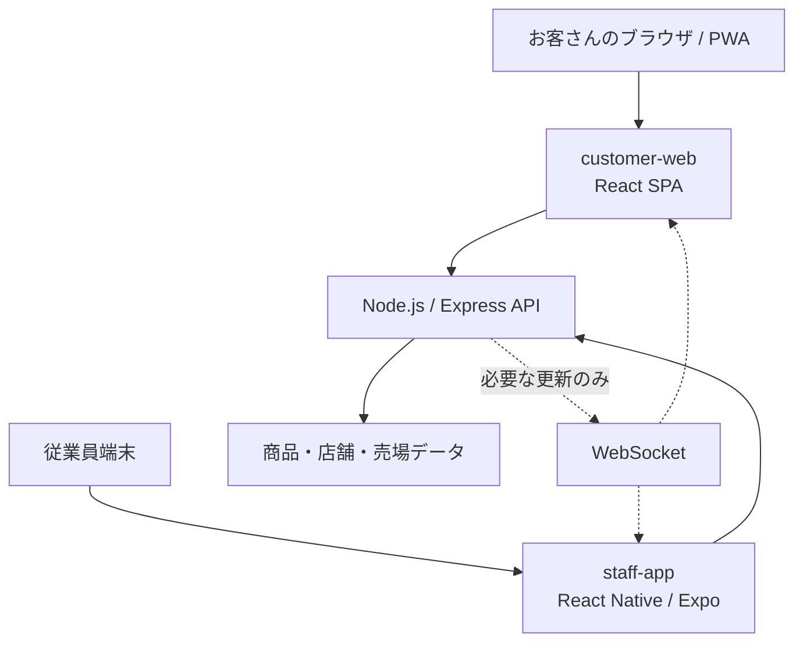
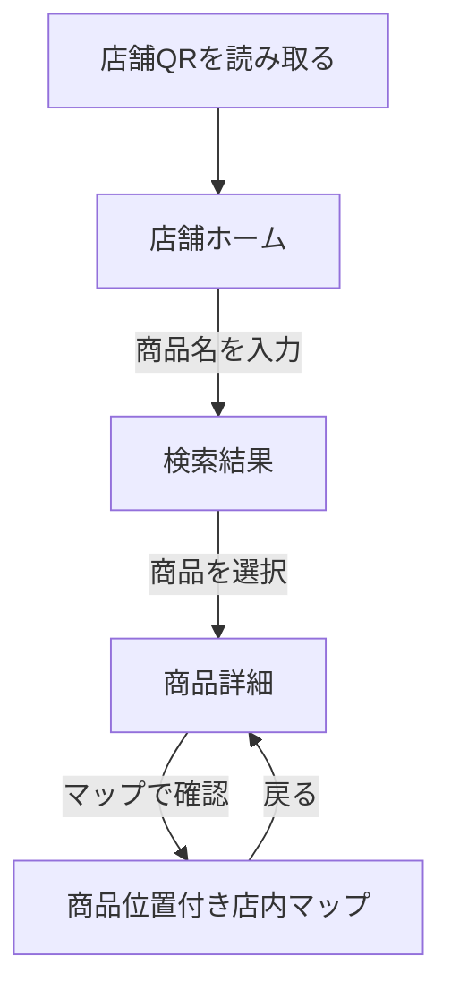

# Urinavi React SPA移行設計書・Claude Code完成版プロンプト

## 1. 結論

UrinaviのSPA化は、**お客さん向けWebアプリ（React + PWA）を対象**に進める。

- お客さん向け：React + Vite + PWA + React RouterによるSPA
- 従業員向け：React Native + Expoを継続（Web SPAへ統合しない）
- バックエンド：Node.js + Expressを継続
- リアルタイム更新：必要な機能だけWebSocketを利用
- 管理画面：将来、別のReact SPAとして追加可能

SPAは「全機能を1画面に表示する方式」ではない。ブラウザが最初に1つの`index.html`を読み込み、その後はReact RouterがURLと画面を切り替え、通常の画面遷移でページ全体を再読み込みしない構成を指す。

現在のUrinaviでは、お客さん向け画面と従業員向け画面の利用環境・必要機能が異なる。したがって、2つを無理に1つのReact Webアプリへまとめず、**顧客Web・従業員アプリ・APIの3つを分離したまま連携させる**のが適切である。

## 2. 現在の前提

本設計では、以下のUrinaviの方針を維持する。

- お客さんは店舗のQRコードからPWAへアクセスする
- お客さん側はログイン不要で、すぐ商品を検索できる
- 従業員側はReact Native / Expoを使用する
- お客さん側と従業員側は同じNode.js APIを利用する
- 商品位置は棚番ではなく、通路番号・売場名・目印・マップ位置で表現する
- 「在庫あり」と断定する在庫管理アプリにはしない
- 初期版ではマイページ、POS連携、複雑なタスク管理を入れない
- 従業員側の操作は「検索する → 場所を見る → 作業する」を基本とする
- 緑系のデザインと、スマートフォンで押しやすいUIを維持する
- Android、iPhone、PCの各画面幅で崩れないようにする

## 3. 推奨システム構成



推奨リポジトリ構成は次のとおり。ただし、既存リポジトリを一度に全面移動する必要はなく、現状の名前に合わせて段階的に整理する。

```text
urinavi/
├─ apps/
│  ├─ customer-web/          # React + Vite + PWA + React Router
│  │  ├─ public/
│  │  ├─ src/
│  │  └─ package.json
│  ├─ staff-app/             # React Native + Expo（既存を維持）
│  └─ admin-web/             # 将来追加する管理画面
├─ services/
│  └─ api/                   # Node.js + Express + WebSocket
├─ packages/
│  └─ shared-types/          # 必要になった段階で共通型を配置
└─ README.md
```

### SPA移行で変更する範囲

主に`customer-web`内を変更する。

- React Routerの導入
- URLと画面コンポーネントの対応付け
- 共通レイアウトの作成
- 既存の画面切り替え処理をルート遷移へ変更
- 検索語・店舗ID・商品IDをURLで管理
- 直リンクと再読み込みに対応
- WebサーバーのHistory API fallbackを設定
- PWAのナビゲーションフォールバックを確認

### SPA移行で変更しない範囲

- React Native / Expoの従業員アプリをReact Webへ作り直さない
- Node.js APIの既存仕様を理由なく変更しない
- 商品データ、画面デザイン、検索ロジックを全面的に作り直さない
- 未実装の在庫連携、POS連携、マイページを同時に追加しない

## 4. ルーティング設計

### 4.1 基本方針

- `BrowserRouter`方式のきれいなURLを使用する
- 店舗ごとのQRコードと直リンクに対応するため、`storeId`をパスに含める
- 検索語は共有・再読み込みできるようクエリパラメータに含める
- 商品、カテゴリなどの識別子はパスパラメータに含める
- モーダルを主要画面の代わりにしない
- 外部サイト以外では`<a href>`や`window.location.href`による画面遷移を使わない
- React Routerの`Link`、`NavLink`、`useNavigate`を使う

### 4.2 推奨ルート一覧

| URL | 画面 | 目的 |
|---|---|---|
| `/` | 店舗解決画面 | 店舗指定がないアクセスを案内する。既定店舗がある開発環境ではリダイレクト可 |
| `/s/:storeCode` | QR入口 | QR用の短い店舗コードを解決し、正式な店舗URLへリダイレクトする |
| `/stores/:storeId` | お客さんホーム | 検索、カテゴリ、マップ、よく探される商品を表示する |
| `/stores/:storeId/search?q=牛乳` | 商品検索結果 | 検索語に一致する商品一覧を表示する |
| `/stores/:storeId/categories` | カテゴリ一覧 | 商品名が分からない人がカテゴリから探す |
| `/stores/:storeId/categories/:categoryId` | カテゴリ別商品一覧 | 選択カテゴリの商品を表示する |
| `/stores/:storeId/products/:productId` | 商品詳細 | 商品情報、通路、売場、目印、売場状態を表示する |
| `/stores/:storeId/map` | 店内マップ | 店舗全体のマップを表示する |
| `/stores/:storeId/map?productId=:productId` | 商品位置付きマップ | 対象商品の位置を強調表示する |
| `*` | 404 | 存在しないURLから戻れるようにする |

`/s/:storeCode`はQRコードを短く保つための入口である。APIで店舗コードを解決後、`replace: true`で`/stores/:storeId`へ移動する。最初からQRに`/stores/:storeId`を含められる場合は、この短縮ルートを省略してもよい。

### 4.3 ルートツリー

```text
/
├─ s/:storeCode
├─ stores/:storeId
│  ├─ index                         お客さんホーム
│  ├─ search?q=...
│  ├─ categories
│  ├─ categories/:categoryId
│  ├─ products/:productId
│  └─ map?productId=...
└─ *                                404
```

### 4.4 React Router構成イメージ

```jsx
const router = createBrowserRouter([
  {
    path: "/",
    element: <RootPage />,
  },
  {
    path: "/s/:storeCode",
    element: <StoreCodeResolverPage />,
  },
  {
    path: "/stores/:storeId",
    element: <StoreRouteGuard />,
    errorElement: <RouteErrorPage />,
    children: [
      {
        element: <CustomerLayout />,
        children: [
          { index: true, element: <HomePage /> },
          { path: "search", element: <SearchPage /> },
          { path: "categories", element: <CategoryListPage /> },
          { path: "categories/:categoryId", element: <CategoryProductsPage /> },
          { path: "products/:productId", element: <ProductDetailPage /> },
          { path: "map", element: <StoreMapPage /> },
        ],
      },
    ],
  },
  {
    path: "*",
    element: <NotFoundPage />,
  },
]);
```

`StoreRouteGuard`は、URLの`storeId`が有効かを確認し、店舗情報を子ルートへ提供する。無効な店舗の場合は「店舗が見つかりません」と表示し、単なる404と区別する。

## 5. 画面遷移

### 5.1 QRコードから商品を探す基本導線



### 5.2 カテゴリから探す導線

```text
店舗ホーム
  → カテゴリ一覧
  → カテゴリ別商品一覧
  → 商品詳細
  → 店内マップ
```

### 5.3 画面ごとの遷移ルール

#### 店舗ホーム

- 検索フォーム送信：`/stores/:storeId/search?q=検索語`
- カテゴリ選択：`/stores/:storeId/categories/:categoryId`
- カテゴリをすべて見る：`/stores/:storeId/categories`
- 店内マップ：`/stores/:storeId/map`
- よく探される商品：`/stores/:storeId/products/:productId`

#### 商品検索結果

- 検索語は`useSearchParams()`から取得する
- 検索語の変更時はURLの`q`も更新する
- 商品選択：`/stores/:storeId/products/:productId`
- 0件時はカテゴリ検索や従業員への確認を案内する
- ブラウザの戻る操作で、検索語と検索結果へ戻れるようにする

#### 商品詳細

- URLの`productId`を使って商品を取得する
- 通路番号、売場名、目印、近くの商品を表示する
- 売場状態は在庫数と混同しない
- 「現在、売り場に出ていない可能性があります」など既存方針の表現を維持する
- マップボタン：`/stores/:storeId/map?productId=:productId`
- 近くの商品：対象商品の詳細ルートへ移動する

#### 店内マップ

- `productId`がある場合は対象位置を強調する
- `productId`がない場合は店舗全体を表示する
- 現在地が取得できない前提でも使える表示にする
- 初期版では精密な屋内測位を必須にしない

## 6. 状態管理の設計

### URLで管理する状態

以下は、再読み込み・共有・戻る操作に必要なのでURLへ置く。

- `storeId`
- `storeCode`
- `productId`
- `categoryId`
- 検索語`q`
- マップで強調する商品`productId`

### React内部で管理する状態

以下はURLへ置かず、コンポーネントまたはContextで管理する。

- 検索欄の入力途中の文字
- ローディング状態
- APIエラー状態
- メニューの開閉
- 一時的な表示設定

### 保存してよい状態

ログインを追加せずに保持する場合は`localStorage`を利用できる。

- 最近見た商品
- 最後に開いた店舗
- 文字サイズ設定

初期移行では新しい状態管理ライブラリを必須にしない。既存実装で必要性がなければ、React Context、カスタムフック、URL状態で十分である。API取得ライブラリがすでに導入済みなら、その仕組みを維持する。

## 7. 推奨フロントエンド構成

```text
customer-web/src/
├─ app/
│  ├─ router.jsx                 # ルート定義
│  ├─ providers.jsx              # 必要なProviderを集約
│  └─ routePaths.js              # URL生成関数
├─ layouts/
│  └─ CustomerLayout.jsx         # Header、ナビ、Outlet
├─ pages/
│  ├─ RootPage.jsx
│  ├─ StoreCodeResolverPage.jsx
│  ├─ HomePage.jsx
│  ├─ SearchPage.jsx
│  ├─ CategoryListPage.jsx
│  ├─ CategoryProductsPage.jsx
│  ├─ ProductDetailPage.jsx
│  ├─ StoreMapPage.jsx
│  ├─ NotFoundPage.jsx
│  └─ RouteErrorPage.jsx
├─ features/
│  ├─ stores/
│  │  ├─ StoreRouteGuard.jsx
│  │  ├─ StoreContext.jsx
│  │  └─ storeApi.js
│  ├─ products/
│  │  ├─ components/
│  │  ├─ hooks/
│  │  └─ productApi.js
│  ├─ categories/
│  └─ map/
├─ components/                   # 複数機能で使う共通UI
├─ services/
│  ├─ apiClient.js
│  └─ websocket.js
├─ hooks/
├─ utils/
├─ styles/
├─ App.jsx
└─ main.jsx
```

既存プロジェクトがTypeScriptなら拡張子を`.tsx` / `.ts`にする。JavaScriptで作成済みなら、SPA移行と同時に全ファイルをTypeScriptへ変換せず、既存言語を維持する。

### URLの直書きを避ける

店舗IDや商品IDを含むURLは関数で生成し、文字列の重複を避ける。

```js
export const routePaths = {
  storeHome: (storeId) => `/stores/${storeId}`,
  search: (storeId, query = "") =>
    `/stores/${storeId}/search${query ? `?q=${encodeURIComponent(query)}` : ""}`,
  categories: (storeId) => `/stores/${storeId}/categories`,
  category: (storeId, categoryId) =>
    `/stores/${storeId}/categories/${categoryId}`,
  product: (storeId, productId) =>
    `/stores/${storeId}/products/${productId}`,
  map: (storeId, productId) =>
    `/stores/${storeId}/map${productId ? `?productId=${encodeURIComponent(productId)}` : ""}`,
};
```

## 8. API・WebSocketとの連携

SPA移行は画面遷移方式の変更であり、既存APIを全面変更する作業ではない。まず現在のAPIをサービス層に集約し、ページから直接`fetch`を乱立させない。

既存案に合わせたAPI例：

```http
GET /api/stores/:storeId
GET /api/products/search?keyword=牛乳&storeId=1
GET /api/products/:productId?storeId=1
GET /api/categories
GET /api/categories/:categoryId/products?storeId=1
GET /api/stores/:storeId/map
```

### API連携ルール

- APIのベースURLは環境変数で管理する
- 開発中はViteのproxyを使用できる
- 取得処理にはローディング、エラー、0件の各状態を用意する
- 検索入力ごとの通信には、必要に応じてdebounceと`AbortController`を使う
- HTTPエラーとJSON解析エラーを区別する
- APIレスポンスの形はサービス層で吸収し、UIへ生データを直接広げない
- 店舗IDはすべての店舗依存APIへ渡す

### WebSocket連携ルール

WebSocketはSPAルーターの代わりではない。売場変更などのリアルタイム反映にだけ利用する。

- 接続はページごとではなく、店舗レイアウトまたは専用Providerで管理する
- `storeId`単位のルームへ参加する
- 再接続処理を用意する
- コンポーネントのアンマウント時にイベント購読を解除する
- 初期データ取得はHTTP、更新通知はWebSocketという役割分担にする

## 9. PWA・本番サーバー設定

### 9.1 History API fallback

`BrowserRouter`では、ユーザーが商品詳細URLを直接開いたときも`index.html`を返す必要がある。

#### Node.js / ExpressがReactのビルド成果物も配信する場合

`/api`と静的ファイルを先に処理し、その後のGETリクエストを`index.html`へフォールバックする。Expressのバージョン差でワイルドカード構文が変わる可能性があるため、既存バージョンに合う書き方を使う。

```js
app.use("/api", apiRouter);
app.use(express.static(customerWebDistPath));

app.use((req, res, next) => {
  if (req.method !== "GET" || req.path.startsWith("/api/")) {
    return next();
  }

  return res.sendFile(path.join(customerWebDistPath, "index.html"));
});
```

#### ReactとAPIを別ホストへ配置する場合

フロント側のホスティング設定で、存在しないファイルへのナビゲーションを`/index.html`へrewriteする。APIリクエストまで`index.html`へ書き換えない。

### 9.2 PWAの注意点

- SPAナビゲーションは`index.html`へフォールバックする
- `/api/**`を古い値で固定キャッシュしない
- APIはnetwork-firstまたはnetwork-onlyを基本とする
- 商品画像など更新頻度が低い静的アセットだけを適切にキャッシュする
- Service Worker更新時に古い画面が残らないよう、既存PWA設定を確認する
- `start_url`が店舗固定でない場合は`/`とし、QRのURLは通常のWeb URLとして開く

## 10. 実装手順

### 手順1：現状調査

- `package.json`、`src`、既存ページ、API呼び出しを確認する
- 画面切り替えに使っているstate、条件分岐、`window.location`、`<a href>`を検索する
- 既存のPWA設定、Node.js配信設定、環境変数を確認する
- 現在のビルド・lint・テストが通るか確認し、既存エラーを記録する

### 手順2：ルーターの土台を作る

- 未導入の場合だけ`react-router-dom`を追加する
- `main.jsx`では`RouterProvider`を1回だけマウントする
- `router.jsx`、`CustomerLayout`、`Outlet`を作る
- 共通ヘッダーやナビゲーションをレイアウトへ移す

### 手順3：既存画面をページ化する

- 既存デザインと機能を保ったまま、ホーム、検索、カテゴリ、商品詳細、マップをページコンポーネントへ分ける
- 一度にUIを全面変更しない
- ページ固有のデータ取得をページまたはfeature hookへ移す

### 手順4：画面遷移を置き換える

- stateだけで表示画面を切り替える処理をルート遷移へ変更する
- 内部リンクを`Link` / `NavLink`へ変更する
- 操作後の移動を`useNavigate`へ変更する
- `window.location.href`や通常の内部`<a href>`を削除する
- 戻る・進む操作を壊さない

### 手順5：URL状態へ移行する

- 検索語を`?q=`へ移す
- `storeId`、`categoryId`、`productId`をパスから取得する
- 直接アクセス時にも必要なデータをAPIまたは既存JSONから再取得する
- React Routerの`location.state`だけに必須情報を持たせない

### 手順6：例外画面を追加する

- 全画面ローディング
- 部分ローディング
- APIエラー
- 店舗が見つからない
- 商品が見つからない
- 検索0件
- 404

### 手順7：サーバーとPWAを対応させる

- 深いURLの再読み込みで`index.html`が返るようにする
- APIや画像ファイルをSPA fallbackの対象から外す
- PWAのnavigation fallbackとAPIキャッシュ方針を確認する

### 手順8：段階的に検証する

- ホームから各画面へ移動できる
- ページ全体の再読み込みが発生しない
- ブラウザの戻る・進むが動く
- 検索URLを直接開いて同じ結果になる
- 商品詳細URLを直接開いて表示できる
- 商品詳細URLで再読み込みしても404にならない
- 別店舗の商品データが混ざらない
- Android、iPhone、PC幅でレイアウトが崩れない
- PWAとしてインストール可能な状態を維持する
- build、lint、既存テストが通る

## 11. 完了条件

- お客さん向けWebアプリがReact Routerを使っている
- Reactルーターはアプリ全体で1つだけである
- 主要画面に固有URLがある
- 内部遷移でドキュメント全体を再読み込みしない
- 検索語を含むURLを共有・再読み込みできる
- QRから店舗別ホームへ直接入れる
- 商品詳細・カテゴリ・マップへ直接アクセスできる
- 無効な店舗、商品、URLに適切な案内がある
- Node.jsまたはホスティング側でHistory API fallbackが動く
- APIルートと静的アセットがSPA fallbackに飲み込まれない
- 従業員向けReact Nativeアプリが壊れていない
- 既存の緑系デザイン、検索、商品詳細、店内マップ機能が維持されている
- 在庫数を断定する新機能や、不要なマイページを追加していない

---

# Claude Code用・完成版プロンプト

以下をUrinaviリポジトリのルートでClaude Codeへ貼り付ける。Claude Codeへ画像も渡す場合は、現在のデザインを維持する参考画像として同時に添付する。

````text
あなたはUrinaviの既存コードを改修するシニアフロントエンドエンジニアです。

このタスクでは、お客さん向けReact Webアプリを、現在のデザインと機能を保ったままReact Routerによるシングルページアプリ（SPA）へ移行してください。調査だけで終わらず、必要なコード変更、設定変更、検証まで完了してください。

## Urinaviの前提

Urinaviは「売り場をナビするアプリ」です。

- お客さん向け：React + PWA。店舗のQRコードから利用する
- 従業員向け：React Native + Expo。今回、React Webへ統合しない
- バックエンド：Node.js + Express
- リアルタイム更新：必要な機能のみWebSocketを使う
- 店舗には棚番がないため、商品位置は「通路番号 + 売場名 + 目印 + 店内マップ上の位置」で表す
- お客さん側はログイン不要
- 初期版ではマイページ、POS連携、在庫数表示、複雑なタスク管理を追加しない
- 「売り場にある / 現在は売り場に出ていない可能性がある」という表示と、既存の緑系デザインを維持する
- Android、iPhone、PCの画面幅に対応する

## 最重要方針

1. 最初にリポジトリ全体を確認し、実際のフォルダ構成・package manager・Reactの書き方・PWA設定・Node.js配信設定を把握すること。
2. 既存コードに合わせた最小差分で改修すること。無関係な全面リファクタリングをしないこと。
3. JavaScriptで作られている場合は、今回の作業だけを理由に全体をTypeScriptへ変換しないこと。TypeScriptなら型を維持すること。
4. 既存UI、検索機能、商品詳細、カテゴリ、店内マップ、API呼び出しを削除しないこと。
5. 従業員向けReact Native / Expoアプリとバックエンドを壊さないこと。
6. ルーティングのためだけに新しい状態管理ライブラリを追加しないこと。
7. React Routerはアプリ全体で1回だけマウントすること。
8. BrowserRouter方式のURLを使用し、HashRouterは使用しないこと。
9. 内部画面遷移に`window.location.href`、`window.location.assign`、通常の`<a href>`を使用しないこと。外部リンクを除き、`Link`、`NavLink`、`useNavigate`へ置き換えること。
10. 必須画面情報をReact Routerの`location.state`だけに保存しないこと。再読み込みで復元できるよう、URLパラメータまたはAPI再取得を使うこと。

## 実施内容

### 1. 事前調査

次を確認してください。

- ルートおよび各アプリの`package.json`
- React Webアプリのエントリーポイント
- 現在の画面コンポーネント
- stateや条件分岐による疑似的な画面切り替え
- `window.location`、`location.href`、内部向け`<a href>`の使用箇所
- API呼び出し箇所
- PWA / Service Worker / manifest設定
- Node.js / Expressの静的ファイル配信設定
- 既存のlint、test、buildスクリプト

変更前に、既存のbuild、lint、testを実行できる範囲で確認してください。既存エラーがある場合は、今回の変更によるエラーと混同しないよう記録してください。

### 2. React Routerの導入

`react-router-dom`が未導入の場合だけ、リポジトリで使われているpackage managerで追加してください。

Data Router構成を使える場合は、`createBrowserRouter`と`RouterProvider`を使ってください。既存バージョンや構成の都合で適切でない場合は`BrowserRouter`、`Routes`、`Route`でも構いません。ただしHashRouterは禁止です。

推奨ルートは以下です。

```text
/
/s/:storeCode
/stores/:storeId
/stores/:storeId/search?q=牛乳
/stores/:storeId/categories
/stores/:storeId/categories/:categoryId
/stores/:storeId/products/:productId
/stores/:storeId/map
/stores/:storeId/map?productId=:productId
*
```

`/s/:storeCode`は、既存APIに店舗コード解決機能がある場合に実装し、正式な`/stores/:storeId`へ`replace`遷移させてください。該当APIがなく、現在のQRが直接`storeId`を持てる場合は、無理なダミーAPIを作らず、ルートと説明だけ整えてください。

### 3. ネストされた共通レイアウト

店舗配下のページには共通の`CustomerLayout`を作り、以下を必要に応じて配置してください。

- 既存ヘッダー
- 店舗名
- 検索導線
- カテゴリ導線
- 店内マップ導線
- `Outlet`
- 既存フッターまたはモバイルナビ

共通UIを各ページへ重複コピーしないでください。既存デザインを維持し、SPA移行と無関係な見た目の全面変更はしないでください。

### 4. ページコンポーネント化

既存画面を再利用しながら、次のページをルート単位で整理してください。ファイル名は既存規則に合わせて変更して構いません。

```text
RootPage
StoreCodeResolverPage
HomePage
SearchPage
CategoryListPage
CategoryProductsPage
ProductDetailPage
StoreMapPage
NotFoundPage
RouteErrorPage
```

店舗ルートには`StoreRouteGuard`または同等の仕組みを作り、`storeId`の検証、店舗情報の取得、ローディング、店舗が見つからない場合の表示を共通化してください。

### 5. URLと状態の同期

- `storeId`、`productId`、`categoryId`は`useParams()`から取得する
- 検索語は`useSearchParams()`の`q`から取得する
- 検索フォーム送信時は、`/stores/:storeId/search?q=...`へ遷移する
- 空白だけの検索語は送信しない
- 検索語は`trim`し、URLエンコードする
- 商品詳細はURLの`productId`からデータを再取得できるようにする
- マップは`?productId=`がある場合だけ対象商品の位置を強調する
- ブラウザの戻る・進むで検索条件と画面が自然に復元されるようにする
- 直接URLを開いた場合と、アプリ内遷移した場合で表示結果を一致させる

URL生成文字列が各所に散らばる場合は、既存命名に合わせて`routePaths`のようなURL生成関数を作ってください。

### 6. API連携

既存APIのURL・レスポンス形式を先に確認し、互換性を維持してください。SPA化を理由にAPIを全面変更しないでください。

ページから直接`fetch`が重複している場合は、既存方針に合わせてサービスまたはfeature hookへ整理してください。

以下の状態を必ず扱ってください。

- 初回ローディング
- 再検索中
- APIエラー
- 店舗が見つからない
- 商品が見つからない
- 検索結果0件
- カテゴリ結果0件

商品状態の表示では、在庫数や在庫切れを断定しないでください。既存仕様に合わせて「現在、売り場に出ていない可能性があります」「お近くの従業員にご確認ください」と案内してください。

### 7. WebSocket

既存のWebSocketがある場合だけ、接続ライフサイクルを確認してください。

- ページ遷移のたびに不要な再接続をしない
- 店舗レイアウトまたはProvider単位で接続する
- `storeId`単位で必要なイベントだけ購読する
- アンマウント時に購読解除する
- 初期データはHTTP、更新通知はWebSocketと役割を分ける

未実装の場合は、今回のSPA移行だけを理由にWebSocketサーバーを新規実装しないでください。

### 8. History API fallback

商品詳細などの深いURLをブラウザで直接開いた場合や再読み込みした場合にも、Reactの`index.html`が返るようにしてください。

Node.js / ExpressがReactのbuild成果物を配信している場合は、次の順序を守って既存バージョンに合うfallbackを追加してください。

```text
1. APIルート
2. 静的ファイル
3. API以外のGETリクエストをindex.htmlへfallback
4. API用404 / エラーハンドラーとの競合を防ぐ
```

フロントとAPIが別ホストの場合は、現在のホスティング方式に合うrewrite設定を追加またはドキュメント化してください。API、画像、JS、CSSまで`index.html`へrewriteしないでください。

### 9. PWA設定

既存PWA機能を維持してください。

- SPA navigation fallbackが`index.html`を返すこと
- `/api/**`をcache-firstにしないこと
- APIはnetwork-firstまたはnetwork-onlyを基本にすること
- 静的アセットは既存戦略を尊重すること
- manifest、アイコン、テーマカラー、インストール可能性を壊さないこと
- Service Worker更新後に古いHTMLが残り続けないか確認すること

### 10. アクセシビリティとレスポンシブ対応

- Android、iPhone、PC幅で既存デザインが崩れないこと
- ボタンとリンクに適切な要素を使うこと
- キーボード操作で主要導線を使えること
- ページ遷移後に見出しまたはメイン領域へフォーカスできるよう配慮すること
- ローディングとエラーを文字でも認識できること
- 緑色だけで状態を判別させないこと

### 11. テストと検証

既存テスト環境がある場合は、最低限次を追加または更新してください。

- 各主要ルートが対応画面を表示する
- 検索フォームが`?q=`付きURLへ遷移する
- 商品選択で商品詳細へ遷移する
- 存在しないURLで404を表示する
- 無効な店舗と無効な商品を適切に表示する

テスト環境がない場合は、このタスクだけで大規模なテスト基盤を追加せず、手動確認項目をREADMEへ残してください。

最後に、リポジトリのpackage managerを使って次を実行してください。

- format（スクリプトがある場合）
- lint（スクリプトがある場合）
- test（スクリプトがある場合）
- build

失敗した場合は原因を調べ、今回の変更が原因なら修正してください。既存エラーで修正範囲外の場合は、その証拠と影響を明記してください。

## 完了条件

- お客さん向けReact Webアプリが実際にSPAとして動く
- React Routerが1回だけマウントされている
- ホーム、検索、カテゴリ、商品詳細、マップに固有URLがある
- 内部遷移でページ全体が再読み込みされない
- 検索URL、商品詳細URLを直接開いて表示できる
- 深いURLを再読み込みしてもサーバー404にならない
- ブラウザの戻る・進むが正常に動く
- 店舗IDが異なるデータを混在させない
- PWA機能が維持される
- 従業員向けReact Nativeアプリが壊れていない
- buildが成功する

## 作業完了時の報告形式

作業完了後は、次の順で簡潔に報告してください。

1. 実装した内容
2. 追加・変更した主なファイル
3. 最終ルーティング一覧
4. History API fallbackとPWAで行った対応
5. 実行した検証コマンドと結果
6. 残っている課題（本当にある場合のみ）

まず既存コードを調査し、その結果に合わせて実装を開始してください。質問待ちで止まらず、既存コードから安全に判断できる範囲は自律的に進めてください。
````

## 12. Claude Codeへ渡すときの補足

このプロンプトは、Claude CodeをUrinaviのリポジトリ直下で起動して貼り付ける想定である。現在のUI画像がある場合は一緒に渡すと、SPA化に伴う不要なデザイン変更を防ぎやすい。

最初の実装単位としては、次の順が安全である。

```text
ホーム → 検索 → 商品詳細 → カテゴリ → マップ → fallback/PWA → 全体検証
```

SPA移行後に管理画面を作る場合は、お客さん向けのルートへ混在させず、`admin-web`を別アプリとして用意するか、少なくとも`/admin`配下で認証・レイアウト・権限を完全に分ける。
